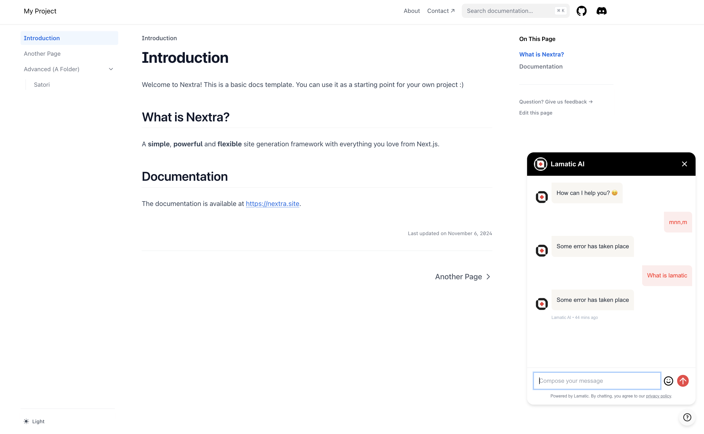

# Lamatic <> Nextra Docs Starter Kit

A powerful documentation template that combines [Nextra](https://nextra.site)'s modern documentation framework with [Lamatic](http://lamatic.ai)'s intelligent AI capabilities. This integration enables dynamic, interactive documentation with built-in AI-powered chat features.


## Features

- 🤖 **AI-Powered Chat**: Embedded Lamatic chatbot that helps users find information and answers questions
- 🔄 **Auto-Indexing**: Automatic documentation indexing through GitHub Actions
- 📚 **RAG Integration**: Retrieval-Augmented Generation for accurate, context-aware responses
- ⚡ **Real-time Updates**: Documentation and chatbot automatically stay in sync

This starter kit includes a fully functional example with two key flows:
1. A documentation indexing pipeline that maintains an up-to-date vector store of your content (found in the `flows/index-github-actions.yaml` file)
2. A document-aware chatbot that leverages your documentation to provide intelligent responses (found in the `flows/document-chatbot.yaml` file)

## Getting Started

### 1. Clone the Repository

```bash
git clone https://github.com/Lamatic/lamatic-nextra-starter-kit.git
cd lamatic-nextra-starter-kit
```

### 2. Configure Lamatic flows

You'll need to set up two essential flows on <a href="https://studio.lamatic.ai/" target="_blank" rel="noopener noreferrer">Lamatic</a>:


#### 2.1 Documentation Indexing Flow
- Creates and maintains a vector store of your Nextra documentation
- Automatically indexes new content when documentation is updated

[](https://studio.lamatic.ai/_?templateSlug=index-github-action)

#### 2.2 RAG-Enhanced Chatbot Flow
- Implements Retrieval-Augmented Generation (RAG) for accurate responses
- Utilizes the indexed documentation to provide context-aware answers
- Handles user queries with documentation-specific knowledge

[](https://studio.lamatic.ai/_?templateSlug=document-chatbot-widget)

> Refer to the [Lamatic documentation](https://lamatic.ai/docs/flows/editor) for more details.


### 3. Configure GitHub Secrets

Add the following secrets to your GitHub repository:

- `WEBHOOK_URL`: Your Lamatic webhook URL for triggering flows
- `WEBHOOK_KEY`: (Optional) API key can be used when using [API as a trigger](https://lamatic.ai/docs/interface/graphql)

> Refer to the [Github Secrets Setup](https://docs.github.com/en/actions/security-for-github-actions/security-guides/using-secrets-in-github-actions) for more details.

### 4. Deploy on Vercel

Configure the following environment variables in your Vercel project settings:

- `NEXT_PUBLIC_LAMATIC_BOT_NAME`: Your chatbot's display name
- `NEXT_PUBLIC_LAMATIC_API_URL`: Your Lamatic API URL
- `NEXT_PUBLIC_LAMATIC_FLOW_ID`: Your Lamatic flow ID
- `NEXT_PUBLIC_LAMATIC_CHAT_HEADER_BG_COLOR`: Your chatbot's header background color (default: black) (can be any valid CSS color)
- `NEXT_PUBLIC_LAMATIC_SUGGESTIONS`: Initial suggestions/prompts for users (comma-separated)
- `NEXT_PUBLIC_LAMATIC_IMAGE_URL`: Your chatbot's image URL (default: Lamatic logo)
- `NEXT_PUBLIC_LAMATIC_POSITION`: Your chatbot's position (default: right) (can be left or right)
- `NEXT_PUBLIC_LAMATIC_FLOATING_BUTTON_ICON`: Your chatbot's floating button icon (default: help-circle.svg) (can be any valid image URL)
- `NEXT_PUBLIC_LAMATIC_ERROR_MESSAGE`: Your chatbot's error message (default: Some error has taken place)

[](https://vercel.com/new/clone?repository-url=https%3A%2F%2Fgithub.com%2FLamatic%2Flamatic-nextra-starter-kit.git&env=NEXT_PUBLIC_LAMATIC_BOT_NAME,NEXT_PUBLIC_LAMATIC_API_URL,NEXT_PUBLIC_LAMATIC_FLOW_ID,NEXT_PUBLIC_LAMATIC_CHAT_HEADER_BG_COLOR,NEXT_PUBLIC_LAMATIC_SUGGESTIONS,NEXT_PUBLIC_LAMATIC_IMAGE_URL,NEXT_PUBLIC_LAMATIC_POSITION,NEXT_PUBLIC_LAMATIC_FLOATING_BUTTON_ICON,NEXT_PUBLIC_LAMATIC_ERROR_MESSAGE&project-name=lamatic-nextra-starter-kit&repository-name=lamatic-nextra-starter-kit)


## Local Development

First, run `pnpm i` to install the dependencies.

Then, run `pnpm dev` to start the development server and visit localhost:3000.

## License

This project is licensed under the MIT License.
